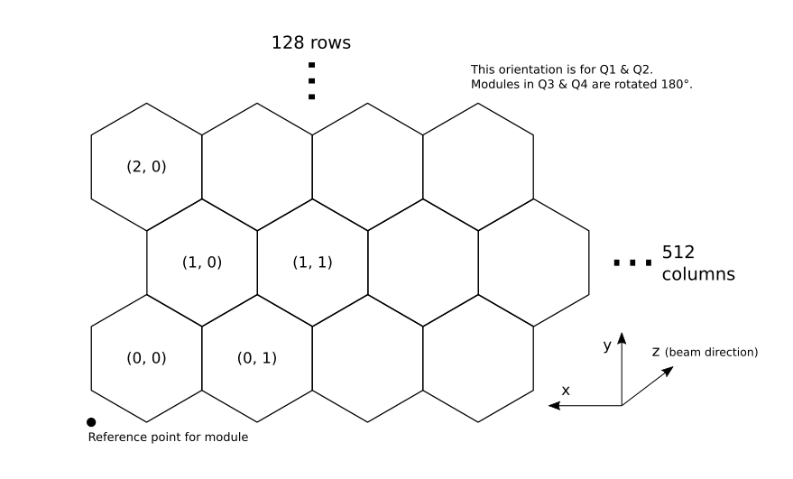

Detector geometry reference
===========================

.. module:: extra_geom

The AGIPD and LPD detectors are made up of several sensor modules,
from which separate streams of data are recorded.
Inspecting or processing data from these detectors therefore depends on
knowing how the modules are arranged. EXtra-geom handles this information.

All the coordinates used in this module are from the detector centre.
This should be roughly where the beam passes through the detector.
They follow the standard European XFEL axis orientations, with x increasing to
the left (looking along the beam), and y increasing upwards.

.. note::

   This module includes methods to assemble data into a single array.
   This is sufficient for a quick examination of detector images, but the
   detector pixels may not line up with the grid imposed by a single array.
   For accurate analysis, it's best to use a tool that can process
   geometry internally with sub-pixel precision.

.. _det-AGIPD-1M:

AGIPD-1M
--------

AGIPD-1M consists of 16 modules of 512×128 pixels each.
Each module is further subdivided into 8 tiles.
The layout of tiles within a module is fixed by the manufacturing process,
but this geometry code works with a position for each tile.

.. figure:: _static/agipd_layout.png

   The approximate layout of AGIPD-1M, in a front view (looking along the beam).

.. autoclass:: AGIPD_1MGeometry

   .. automethod:: from_quad_positions

   .. automethod:: from_crystfel_geom

   .. automethod:: offset

   .. automethod:: rotate

   .. automethod:: quad_positions

   .. automethod:: write_crystfel_geom

   .. automethod:: get_pixel_positions

   .. automethod:: to_distortion_array

   .. automethod:: to_pyfai_detector

   .. automethod:: plot_data

   .. automethod:: position_modules

   .. automethod:: output_array_for_position

   .. automethod:: position_modules_symmetric

   .. automethod:: position_modules_interpolate

   .. automethod:: inspect

   .. automethod:: compare

   .. automethod:: data_coords_to_positions

.. autofunction:: agipd_asic_seams

   See :doc:`masks` for an illustration of this.

.. _det-AGIPD-500K2G:

AGIPD-500K2G
------------

AGIPD-500K2G consists of 8 modules of 512×128 pixels each.
Each module is further subdivided into 8 tiles.
The layout of tiles within a module is fixed by the manufacturing process,
but this geometry code works with a position for each tile.

   The approximate layout of AGIPD-500K2G, in a front view (looking along the beam).

.. autoclass:: AGIPD_500K2GGeometry

   .. automethod:: from_origin

   .. automethod:: from_crystfel_geom

   .. automethod:: write_crystfel_geom

   .. automethod:: get_pixel_positions

   .. automethod:: to_distortion_array

   .. automethod:: to_pyfai_detector

   .. automethod:: plot_data

   .. automethod:: position_modules

   .. automethod:: output_array_for_position

   .. automethod:: position_modules_symmetric

   .. automethod:: inspect

   .. automethod:: compare

   .. automethod:: data_coords_to_positions

The :func:`agipd_asic_seams` also applies to AGIPD-500K2G.

.. _det-LPD-1M:

LPD-1M
------

LPD-1M consists of 16 supermodules of 256×256 pixels each.
Each supermodule is further subdivided into 16 sensor tiles,
which this geometry code can position independently.

   The approximate layout of LPD-1M, in a front view (looking along the beam).

.. autoclass:: LPD_1MGeometry

   .. automethod:: from_quad_positions

   .. automethod:: from_h5_file_and_quad_positions

   .. automethod:: from_h5_file

   .. automethod:: from_crystfel_geom

   .. automethod:: offset

   .. automethod:: rotate

   .. automethod:: quad_positions

   .. automethod:: to_h5_file_and_quad_positions

   .. automethod:: write_crystfel_geom

   .. automethod:: get_pixel_positions

   .. automethod:: to_distortion_array

   .. automethod:: to_pyfai_detector

   .. automethod:: plot_data

   .. automethod:: position_modules

   .. automethod:: output_array_for_position

   .. automethod:: position_modules_symmetric

   .. automethod:: inspect

   .. automethod:: compare

   .. automethod:: data_coords_to_positions

.. _det-DSSC-1M:

DSSC-1M
-------

DSSC-1M consists of 16 modules of 128×512 pixels each.
Each module is further subdivided into 2 sensor tiles,
which this geometry code can position independently.

.. figure:: _static/dssc_layout.png

   The approximate layout of DSSC-1M, in a front view (looking along the beam).

The pixels in each DSSC module are tesselating hexagons.
This is handled in :meth:`~.DSSC_1MGeometry.get_pixel_positions` and
:meth:`~.DSSC_1MGeometry.to_distortion_array`, but assembling an image treats
the pixels as rectangles to simplify processing.
This is adequate for previewing detector images, but some pixels will be
approximately half a pixel width from their true position.

   Detail of hexagonal pixels in the corner of one DSSC module.

.. autoclass:: DSSC_1MGeometry

   .. automethod:: from_quad_positions

   .. automethod:: from_h5_file_and_quad_positions

   .. automethod:: from_h5_file

   .. automethod:: offset

   .. automethod:: rotate

   .. automethod:: quad_positions

   .. automethod:: to_h5_file_and_quad_positions

   .. automethod:: get_pixel_positions

   .. automethod:: to_distortion_array

   .. automethod:: to_pyfai_detector

   .. automethod:: plot_data

   .. automethod:: position_modules

   .. automethod:: output_array_for_position

   .. automethod:: inspect

   .. automethod:: compare

.. _det-JUNGFRAU:

JUNGFRAU
--------

JUNGFRAU detectors can be made with varying numbers of 512×1024 pixel modules.
Each module is further subdivided into 8 sensor tiles.

.. note:: Reading & writing geometry files for JUNGFRAU is not yet implemented.

.. autoclass:: JUNGFRAUGeometry

   .. automethod:: from_module_positions

   .. automethod:: from_crystfel_geom

   .. automethod:: write_crystfel_geom

   .. automethod:: get_pixel_positions

   .. automethod:: to_distortion_array

   .. automethod:: plot_data

   .. automethod:: position_modules

   .. automethod:: output_array_for_position

   .. automethod:: inspect

   .. automethod:: compare

.. _det-PNCCD:

PNCCD
-----

PNCCD detectors have two movable modules of 1024×512 pixels, each of which is a
single tile.

.. autoclass:: PNCCDGeometry

   .. autoattribute:: expected_data_shape

   .. automethod:: from_relative_positions

   .. automethod:: from_absolute_positions

   .. automethod:: plot_data

   .. automethod:: position_modules

   .. automethod:: output_array_for_position

   .. automethod:: inspect

   .. automethod:: compare

.. _det-EPIX:

ePix100/ePix10K
---------------

ePix100 detectors have one module of 704 × 768 pixels. Module built from 4 ASICs with 352 rows and 384 columns of pixels with wide pixes on inner edges. Normal pixels are 50 × 50 um.

ePix10K detectors have one module of 352 × 384 pixels. Module built from 4 ASICs with 176 rows and 192 columns of pixels with wide pixes on inner edges. Normal pixels are 100 × 100 um.

.. note:: References are given for :class:`Epix100Geometry` providing ePix100 layout. For ePix10K, use :class:`Epix10KGeometry` with the same interface.

.. autoclass:: Epix100Geometry

   .. automethod:: from_origin

   .. automethod:: from_relative_positions

   .. automethod:: from_crystfel_geom

   .. automethod:: write_crystfel_geom

   .. automethod:: get_pixel_positions

   .. automethod:: plot_data

   .. automethod:: position_modules

   .. automethod:: normalize_data

   .. automethod:: output_array_for_position

   .. automethod:: inspect

   .. automethod:: compare
   
   .. automethod:: asic_seams
   
   .. automethod:: pixel_areas

Generic Detector
----------------

Generic detector may represent an unconstrained detector of your choice.

.. autoclass:: GenericGeometry

   .. automethod:: from_simple_description

   .. automethod:: write_crystfel_geom

   .. automethod:: get_pixel_positions

   .. automethod:: plot_data

   .. automethod:: position_modules

   .. automethod:: output_array_for_position

   .. automethod:: inspect

   .. automethod:: compare
